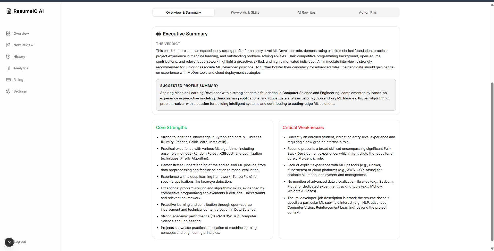
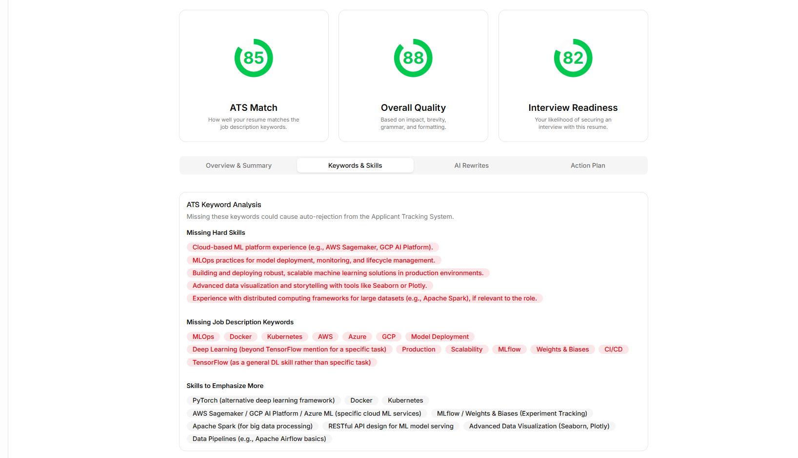
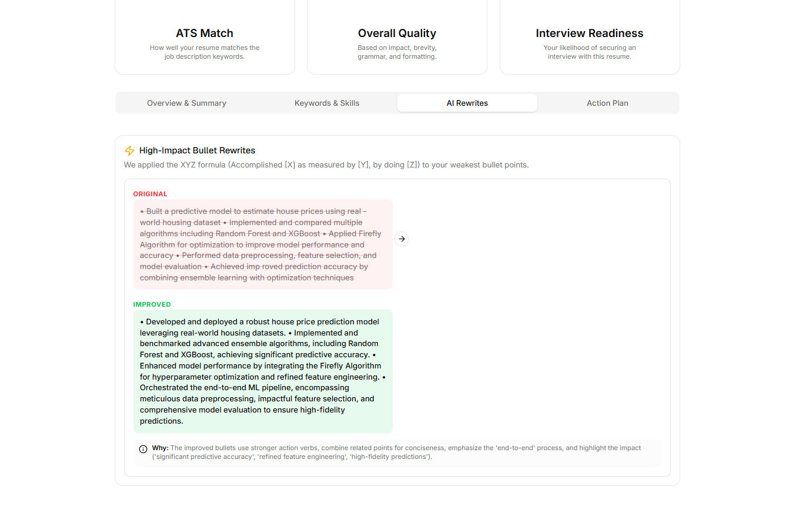
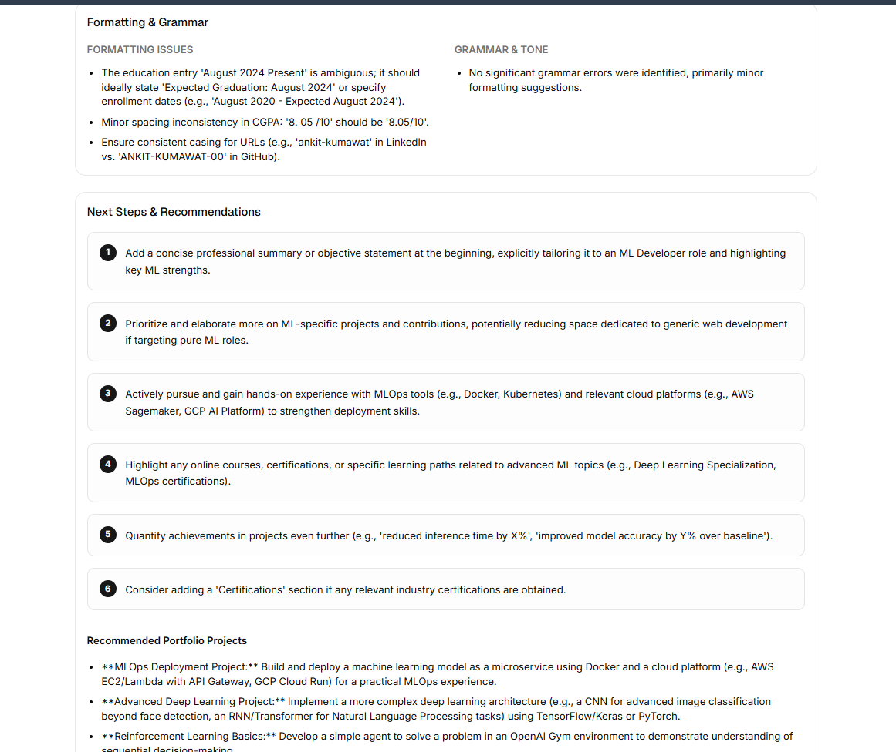

# ResumeIQ AI

ResumeIQ AI is an intelligent resume review platform that helps job seekers improve their resumes using AI-powered analysis. Instead of relying on generic templates or manual reviews, users can upload their resumes and receive instant, personalized feedback on content, structure, readability, and overall quality.

The goal of this project is to make resume improvement faster, smarter, and more accessible for students, fresh graduates, and professionals preparing for internships or full-time roles.

---

## Why ResumeIQ AI?

Creating a strong resume is often challenging, especially for students and first-time job seekers. Many people don't know whether their resume effectively highlights their skills or meets recruiter expectations.

ResumeIQ AI was built to solve this problem by providing immediate AI-generated suggestions that help users create stronger, more professional resumes without waiting for manual reviews.

---

## Features

- Secure user authentication
- Email verification for new users
- AI-powered resume analysis
- Upload and review PDF resumes
- Personalized feedback and improvement suggestions
- Clean and responsive dashboard
- Premium subscription flow using Razorpay
- Modern and user-friendly interface

---

## Tech Stack

### Frontend
- Next.js 16
- React 19
- TypeScript
- Tailwind CSS
- shadcn/ui

### Backend
- Next.js Server Actions
- Supabase

### Database
- Supabase PostgreSQL

### Authentication
- Supabase Authentication

### AI
- Google Gemini API

### Payments
- Razorpay

### Deployment
- Vercel

---

## Project Structure

```text
app/
components/
lib/
public/
supabase/
middleware.ts
```

---

## Installation

Clone the repository

```bash
git clone https://github.com/yourusername/resumeiq-ai.git
```

Move into the project directory

```bash
cd resumeiq-ai
```

Install dependencies

```bash
npm install
```

Create an environment file

```bash
cp .env.example .env.local
```

Run the development server

```bash
npm run dev
```

---

## Environment Variables

Create a `.env.local` file and configure the following variables:

```env
NEXT_PUBLIC_SUPABASE_URL=

NEXT_PUBLIC_SUPABASE_ANON_KEY=

SUPABASE_SERVICE_ROLE_KEY=

NEXT_PUBLIC_RAZORPAY_KEY_ID=

RAZORPAY_KEY_ID=

RAZORPAY_KEY_SECRET=

GEMINI_API_KEY=
```

---

## How It Works

1. Create an account.
2. Verify your email.
3. Sign in to your dashboard.
4. Upload a PDF resume.
5. AI analyzes the resume.
6. Receive personalized feedback and improvement suggestions.
7. Upgrade to Pro for premium features.

---

## Challenges Faced

During development, several challenges were encountered:

- Integrating AI responses into a smooth user experience
- Secure authentication and session management
- Resume upload and processing
- Payment gateway integration with Razorpay
- Designing a clean and intuitive interface

Each challenge helped improve both the technical implementation and overall user experience.

---

## Future Improvements

- ATS compatibility score
- Resume keyword optimization
- Multiple resume versions
- Cover letter generation
- AI interview preparation
- Resume history and version tracking
- Recruiter dashboard

---

## Screenshots

Add your screenshots here.

- Landing Page
- Authentication
- Dashboard
- Resume Upload
- AI Review
- Billing Page

---

## Acknowledgements

This project was built using:

- Next.js
- React
- Supabase
- Google Gemini
- Razorpay
- Tailwind CSS
- shadcn/ui

A big thanks to the open-source community for providing the tools and resources that made this project possible.

---

## License

This project is created for educational purposes and hackathon participation.


Have a look on my work----



